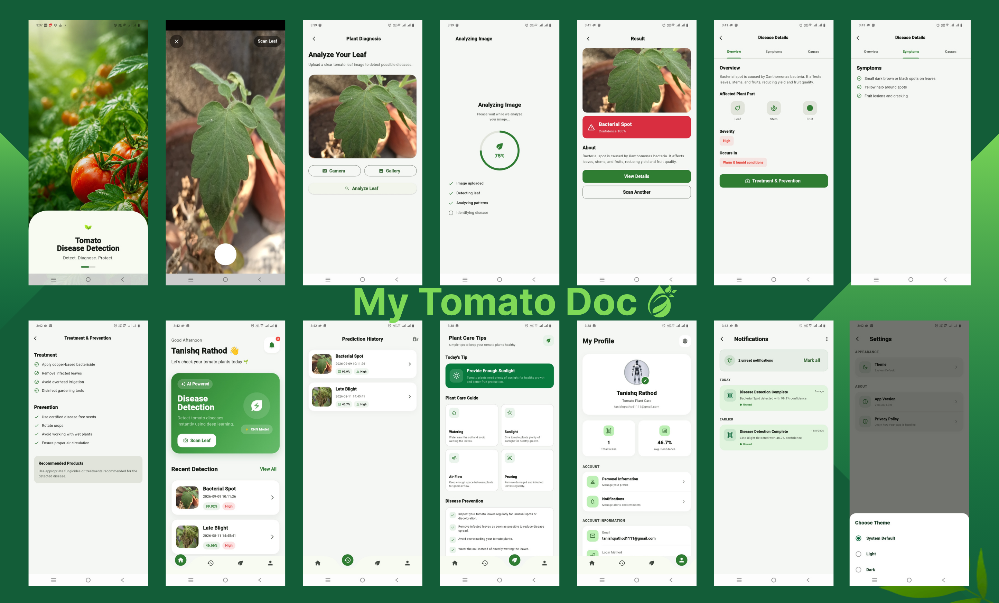

# 🍅 My Tomato Doc — Tomato Disease Detection

**My Tomato Doc** is an AI-powered tomato plant disease detection application that uses a **Convolutional Neural Network (CNN)** to identify tomato leaf diseases from images.

The project combines a **TensorFlow/Keras deep learning model**, **FastAPI REST API**, and a **Flutter mobile application** to provide an end-to-end disease detection experience.

Users can capture or upload a tomato leaf image, analyze it using the trained CNN model, and receive the predicted disease along with confidence, severity, symptoms, causes, treatment, and prevention information.

---

## 📱 Application Preview

<p align="center">
  
</p>

> **My Tomato Doc** provides an end-to-end workflow from capturing a tomato leaf image to AI-powered disease detection and plant-care guidance.

---

## 🚀 Overview

Tomato plants can be affected by several diseases that reduce plant health and crop productivity. Early identification can help users understand potential problems and take appropriate action.

This project uses **deep learning and computer vision** to classify tomato leaf images into different disease categories.

The system is built around three major components:

```text
┌─────────────────────────┐
│    Flutter Mobile App   │
│                         │
│  Camera / Gallery       │
│  Image Analysis         │
│  Results & History      │
└────────────┬────────────┘
             │
             │ REST API
             ▼
┌─────────────────────────┐
│      FastAPI Backend    │
│                         │
│  Image Preprocessing    │
│  Model Inference        │
│  Disease Information    │
└────────────┬────────────┘
             │
             ▼
┌─────────────────────────┐
│   TensorFlow / Keras    │
│                         │
│      CNN Model          │
│                         │
│ Disease Classification  │
└─────────────────────────┘
```

---

# ✨ Features

## 🔬 AI-Powered Disease Detection

- Detect tomato leaf diseases from images
- CNN-based image classification
- Prediction confidence score
- Classification across 10 tomato leaf categories
- Returns confidence scores for all supported classes

## 📷 Image Analysis

The mobile application allows users to:

- Capture a tomato leaf using the camera
- Select an image from the gallery
- Upload the image for analysis
- View the analysis progress
- Receive the AI prediction

## 🩺 Disease Information

After detecting a disease, the application provides additional information including:

- Disease name
- Confidence score
- Severity
- Disease overview
- Symptoms
- Causes
- Affected plant information
- Treatment recommendations
- Prevention recommendations

## 📊 Prediction History

Users can review previous disease detections and their prediction results.

The application can display:

- Previously detected diseases
- Confidence scores
- Severity
- Detection date and time
- Previously analyzed images

## 🌱 Plant Care

The application also provides general plant-care guidance such as:

- Watering
- Sunlight
- Air flow
- Pruning
- Disease prevention
- Plant-care tips

## 🔔 Notifications

The application includes notifications related to completed disease detections and other application events.

## 👤 User Profile

The application includes a profile section with:

- User information
- Detection statistics
- Average confidence
- Account settings
- Notification settings

## ⚙️ Settings

Users can manage application preferences including:

- Application theme
- Notifications
- Privacy settings
- Application information

---

# 🧠 Machine Learning

The core of the project is a **Convolutional Neural Network (CNN)** built using **TensorFlow/Keras**.

The model processes a tomato leaf image and predicts the most likely disease class.

## Machine Learning Pipeline

```text
Tomato Leaf Dataset
        │
        ▼
Image Preprocessing
        │
        ▼
Train / Validation / Test Split
        │
        ▼
CNN Architecture
        │
        ▼
Model Training
        │
        ▼
Model Evaluation
        │
        ▼
Saved Keras Model
        │
        ▼
FastAPI Inference
        │
        ▼
Flutter Application
```

---

# 📚 Disease Classes

The model supports **10 tomato leaf categories**:

1. Bacterial Spot
2. Early Blight
3. Late Blight
4. Leaf Mold
5. Septoria Leaf Spot
6. Spider Mites / Two-Spotted Spider Mite
7. Target Spot
8. Tomato Yellow Leaf Curl Virus
9. Tomato Mosaic Virus
10. Healthy

These class labels correspond to the classes configured in the FastAPI inference service. :contentReference[oaicite:1]{index=1}

---

# 📊 Model Performance

The CNN model achieved **98%+ validation accuracy** during development.

> Validation accuracy represents performance on the validation data used during model development. Real-world performance can vary depending on image quality, lighting, background, camera conditions, leaf orientation, and disease severity.

---

# 🏗️ System Architecture

```text
                         ┌──────────────────────┐
                         │    Flutter Mobile    │
                         │       Application    │
                         │                      │
                         │  • Camera            │
                         │  • Gallery           │
                         │  • Analysis          │
                         │  • Results           │
                         │  • Disease Details   │
                         │  • History           │
                         │  • Plant Care        │
                         │  • Notifications     │
                         └──────────┬───────────┘
                                    │
                                    │ HTTP / REST
                                    ▼
                         ┌──────────────────────┐
                         │     FastAPI API      │
                         │                      │
                         │     POST /predict    │
                         │                      │
                         │  • Image Upload      │
                         │  • Preprocessing     │
                         │  • Model Inference   │
                         │  • Disease Info      │
                         └──────────┬───────────┘
                                    │
                                    ▼
                         ┌──────────────────────┐
                         │  TensorFlow / Keras  │
                         │                      │
                         │      CNN Model       │
                         │                      │
                         │  Image Classification│
                         └──────────────────────┘
```

---

# 🛠️ Tech Stack

## Machine Learning

- Python
- TensorFlow
- Keras
- NumPy
- CNN
- Deep Learning
- Computer Vision
- Image Classification

## Backend

- Python
- FastAPI
- Uvicorn
- REST API
- Pillow
- NumPy
- Python Multipart

## Mobile Application

- Flutter
- Dart
- GetX
- Camera
- Image Picker
- REST API Integration

---

# 📁 Project Structure

```text
tomato-disease-detection/
│
├── api/
│   ├── __init__.py
│   ├── disease_info.py
│   ├── main.py
│   └── requirements.txt
│
├── models/
│   └── 1.keras
│
├── tomato-disease-classification-model.ipynb
│
├── .gitignore
├── .python-version
└── README.md
```

The current repository contains the FastAPI backend under `api/`, the trained Keras model under `models/`, and the model-development notebook at the repository root. :contentReference[oaicite:2]{index=2}

### File Description

| File / Directory | Description |
|---|---|
| `api/main.py` | FastAPI application and model inference logic |
| `api/disease_info.py` | Disease descriptions, symptoms, severity, treatment, and prevention information |
| `api/requirements.txt` | Backend Python dependencies |
| `models/1.keras` | Trained TensorFlow/Keras CNN model |
| `tomato-disease-classification-model.ipynb` | Model training and experimentation notebook |

---

# 🔌 FastAPI Backend

The trained CNN model is served through a **FastAPI REST API**.

The backend loads the trained model from:

```text
models/1.keras
```

The model expects images resized to:

```text
256 × 256 pixels
```

The backend converts uploaded images to RGB format, resizes them, and passes them to the CNN model for prediction. :contentReference[oaicite:3]{index=3}

---

# 📡 API Endpoints

## Health Check

### `GET /ping`

Used to verify that the API is running.

### Example Response

```json
{
  "message": "API is running"
}
```

---

## Disease Prediction

### `POST /predict`

Accepts an uploaded tomato leaf image and performs disease classification.

### Request

```text
POST /predict
Content-Type: multipart/form-data
```

Parameter:

```text
file = tomato_leaf_image.jpg
```

### Response

The API returns information such as:

```json
{
  "class": "Bacterial Spot",
  "confidence": 99.2,
  "severity": "High",
  "description": "...",
  "symptoms": [],
  "treatment": [],
  "prevention": [],
  "image_name": "tomato_leaf.jpg",
  "prediction_time": "2026-09-11 12:30:00",
  "all_predictions": []
}
```

The actual backend returns the predicted class, confidence, severity, description, symptoms, treatment, prevention, image filename, prediction timestamp, and a ranked list of predictions for all supported classes. :contentReference[oaicite:4]{index=4}

---

# 🔄 Prediction Workflow

The prediction process works as follows:

```text
1. User selects or captures an image
                ↓
2. Flutter sends image to FastAPI
                ↓
3. FastAPI receives uploaded image
                ↓
4. Image converted to RGB
                ↓
5. Image resized to 256 × 256
                ↓
6. Image converted to NumPy array
                ↓
7. CNN model performs prediction
                ↓
8. Highest probability class selected
                ↓
9. Disease information retrieved
                ↓
10. API returns prediction details
                ↓
11. Flutter displays the result
```

The current API implementation performs the image conversion, resizing, CNN inference, confidence calculation, and disease-information lookup in this flow. :contentReference[oaicite:5]{index=5}

---

# 🧪 Model Development

The model development and experimentation process is documented in:

```text
tomato-disease-classification-model.ipynb
```

The notebook covers the machine learning workflow from dataset preparation through model training and evaluation.

### Development Workflow

```text
Dataset
   ↓
Image Preprocessing
   ↓
Data Splitting
   ↓
CNN Model
   ↓
Training
   ↓
Validation
   ↓
Evaluation
   ↓
Model Export
```

The resulting model is saved as:

```text
models/1.keras
```

and loaded by the FastAPI backend during application startup. :contentReference[oaicite:6]{index=6}

---

# 📱 Mobile Application — My Tomato Doc

**My Tomato Doc** is the mobile application built around the tomato disease detection model.

The application is designed to provide a complete user experience rather than exposing the machine learning model directly.

## Application Screens

### 🏠 Home

The home screen provides access to the main disease detection functionality and recent detections.

### 📷 Scan Leaf

Users can:

- Open the camera
- Select an image from the gallery
- Preview the selected leaf
- Start disease analysis

### 🔬 Analyzing Image

The application displays an analysis screen while the uploaded image is being processed.

### 🩺 Result

After prediction, the user receives:

- Disease name
- Confidence
- Severity
- Affected plant information
- Disease overview

### 📖 Disease Details

Disease information is organized into sections such as:

- Overview
- Symptoms
- Causes

### 🌱 Treatment & Prevention

Users can access recommendations for:

- Treatment
- Prevention
- Plant care

### 📜 Prediction History

Previous detections can be reviewed from the history section.

### 🌿 Plant Care

The application provides general guidance for maintaining healthy tomato plants.

### 🔔 Notifications

Users can view notifications related to completed disease detections and application events.

### 👤 Profile

The profile section provides user information and detection statistics.

### ⚙️ Settings

The application includes settings for:

- Theme
- Notifications
- Privacy
- Application information

---

# 📸 Application Screenshots

## Application Overview

<p align="center">
  
</p>

---

## 🔬 Leaf Analysis

```text
Capture / Select Image
          ↓
     Preview Leaf
          ↓
      Analyze Leaf
          ↓
    AI Processing
```

The application provides a dedicated analysis flow so users can easily submit a tomato leaf image for classification.

---

## 🩺 Disease Result

The result screen presents the AI prediction together with confidence and severity information.

Users can continue to the detailed disease information screen to learn more about the detected condition.

---

## 📖 Disease Details

Disease details are divided into sections including:

- Overview
- Symptoms
- Causes

This makes the prediction more useful than simply returning a class label.

---

## 🌱 Treatment & Prevention

The application provides disease-specific treatment and prevention guidance after a prediction.

This turns the model output into actionable information for the user.

---

# ⚙️ Backend Setup

## 1. Clone the Repository

```bash
git clone https://github.com/TanishqRathod/tomato-disease-detection.git

cd tomato-disease-detection
```

---

## 2. Create a Virtual Environment

### Conda

```bash
conda create -n tomato-disease python=3.11

conda activate tomato-disease
```

### Python Virtual Environment

```bash
python -m venv venv
```

### macOS / Linux

```bash
source venv/bin/activate
```

### Windows

```bash
venv\Scripts\activate
```

---

## 3. Install Dependencies

Navigate to the API directory:

```bash
cd api
```

Install the project's backend dependencies:

```bash
pip install -r requirements.txt
```

The current requirements include TensorFlow 2.21.0, FastAPI, Uvicorn, python-multipart, Pillow, and NumPy. :contentReference[oaicite:7]{index=7}

---

# ▶️ Run the FastAPI Server

From the repository root:

```bash
uvicorn api.main:app --reload
```

Or run the API module directly according to the project's configuration.

The API will be available at:

```text
http://127.0.0.1:8000
```

---

# 📚 API Documentation

FastAPI automatically provides interactive API documentation.

Once the server is running, open:

```text
http://127.0.0.1:8000/docs
```

You can use the Swagger interface to:

- Check the API
- Test `/ping`
- Upload a tomato leaf image
- Test `/predict`
- Inspect the prediction response

---

# 🧪 Testing the Prediction API

Using `curl`:

```bash
curl -X POST \
  "http://127.0.0.1:8000/predict" \
  -H "accept: application/json" \
  -H "Content-Type: multipart/form-data" \
  -F "file=@tomato_leaf.jpg"
```

The API will return the predicted disease and associated information.

---

# 🧠 Model Input

The API currently preprocesses uploaded images by:

1. Opening the uploaded image
2. Converting it to RGB
3. Resizing it to `256 × 256`
4. Converting it to a NumPy array
5. Adding a batch dimension
6. Passing the image to the trained CNN model

This preprocessing is implemented directly in the FastAPI inference pipeline. :contentReference[oaicite:8]{index=8}

---

# 📊 Prediction Output

The API provides more than the top predicted class.

It returns:

| Output | Description |
|---|---|
| `class` | Predicted disease |
| `confidence` | Confidence percentage for the predicted class |
| `severity` | Disease severity |
| `description` | Disease overview |
| `symptoms` | Known symptoms |
| `treatment` | Treatment recommendations |
| `prevention` | Prevention recommendations |
| `image_name` | Uploaded image filename |
| `prediction_time` | Time of prediction |
| `all_predictions` | Confidence for all supported classes |

The `all_predictions` field is sorted from highest to lowest confidence. :contentReference[oaicite:9]{index=9}

---

# 🎯 Example User Journey

A typical user interaction looks like this:

```text
        🍅 Tomato Plant
              │
              ▼
       📷 Scan Leaf
              │
              ▼
       🖼️ Select Image
              │
              ▼
       🔬 Analyze Image
              │
              ▼
        🧠 CNN Model
              │
              ▼
     🩺 Disease Detected
              │
              ▼
       📊 Confidence
              │
              ▼
      📖 Disease Details
              │
       ┌──────┴──────┐
       ▼             ▼
   Treatment      Prevention
       │             │
       └──────┬──────┘
              ▼
       🌱 Plant Care
```

---

# 💡 Example Use Case

Imagine a user notices unusual spots or discoloration on a tomato leaf.

Instead of manually comparing the leaf with disease images, the user can:

1. Open **My Tomato Doc**
2. Capture a photo of the leaf
3. Submit the image for analysis
4. Wait for the CNN model to process it
5. View the predicted disease
6. Check confidence and severity
7. Read symptoms and causes
8. Review treatment recommendations
9. Review prevention recommendations
10. Save the detection in prediction history

This provides an end-to-end AI-assisted workflow for tomato plant disease identification.

---

# 🛡️ Disclaimer

This application is intended for **educational and AI-assisted plant disease classification purposes**.

The model's prediction should not be considered a definitive agricultural diagnosis. Real-world results can be affected by image quality, lighting, camera conditions, plant variety, disease stage, and environmental factors.

For serious crop disease or agricultural decisions, professional agricultural guidance should be considered.

---

# 🔮 Future Improvements

Potential future improvements include:

### 🤖 Machine Learning

- Improve model generalization on real-world field images
- Add additional tomato disease classes
- Support more plant species
- Improve performance on low-quality images
- Add data augmentation strategies
- Add model explainability using Grad-CAM
- Add disease severity estimation

### 📱 Mobile Application

- Offline disease prediction
- Multilingual support
- Improved accessibility
- Plant monitoring
- Personalized plant-care reminders
- Weather-aware plant recommendations
- More detailed plant health analytics

### ☁️ Backend

- Cloud deployment
- API authentication
- Rate limiting
- Request monitoring
- Model versioning
- Automated model updates
- Logging and analytics

---

# 🎓 Key Learning Outcomes

This project demonstrates practical experience in:

### Machine Learning

- Computer Vision
- Deep Learning
- CNN
- Image Classification
- TensorFlow
- Keras
- Model Training
- Model Evaluation
- Model Inference

### Backend Development

- Python
- FastAPI
- REST APIs
- Image Upload Handling
- API Integration
- Model Serving
- Uvicorn

### Mobile Development

- Flutter
- Dart
- GetX
- Camera Integration
- Gallery Integration
- REST API Integration
- Mobile UI/UX

### End-to-End AI Development

- Machine Learning Model Development
- Model Deployment
- Backend API Development
- Mobile Application Integration
- AI-powered Product Development

---

# 📌 Project Highlights

| Component | Implementation |
|---|---|
| Problem | Tomato leaf disease detection |
| ML Approach | CNN image classification |
| Framework | TensorFlow / Keras |
| Number of Classes | 10 |
| Model Input | 256 × 256 RGB image |
| Backend | FastAPI |
| API | REST |
| Mobile App | Flutter |
| Application Name | My Tomato Doc |
| Model Format | `.keras` |
| API Documentation | Swagger / OpenAPI |

---

# 🌟 Why This Project?

This project goes beyond training a machine learning model.

It demonstrates the complete process of turning a deep learning model into an application:

```text
Machine Learning
      +
Model Deployment
      +
REST API
      +
Mobile Application
      +
User Experience
      =
End-to-End AI Product
```

The goal was to build a practical application where a trained computer vision model can be consumed by a real user through a mobile interface.

---

# 👨‍💻 Author

## Tanishq Rathod

**Data Scientist | Machine Learning | AI/GenAI**

GitHub:  
https://github.com/TanishqRathod

---

# ⭐ Support

If you find this project useful or interesting, consider giving the repository a ⭐ star.

---

## 📄 License

This project is intended for educational and portfolio purposes.
